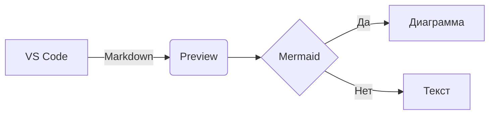

# Привет!

> Цитата для проверки

???spoiler "Нажми меня"
видно?.
???

:::alert
Это уведомление!
:::

```js
console.log('Hello!')
```

Привет :fire: мир

### Диаграмма


```mermaid
graph LR
    A[VS Code] -->|Markdown| B(Preview)
    B --> C{Mermaid}
    C -->|Да| D[ Диаграмма]
    C -->|Нет| E[Текст]
```
